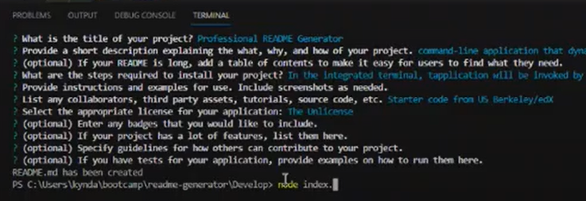

# README Generator

## Description

AS A developer  
I WANT a README generator  
SO THAT I can quickly create a professional README for a new project  

## Installation

Open an integrated terminal and run the 'node index.js' command

## Mock Up

## Credits

Starter code from US Berkeley/edX  
Guidance on what to include in a professional README from [Coding Boot Camp blog](https://coding-boot-camp.github.io/full-stack/github/professional-readme-guide)  
Reference for license types from [ChooseALicense](https://choosealicense.com/licenses/)

## Links

[Github repository](https://github.com/kyndalbowers/readme-generator)  
[Video Walkthrough](https://drive.google.com/file/d/1lv73AuzJhBdRkjnOCMN4LwzFwma7Ggby/view)  
[Sample README file created with generator app](https://github.com/kyndalbowers/readme-generator/blob/main/sample-README.md)